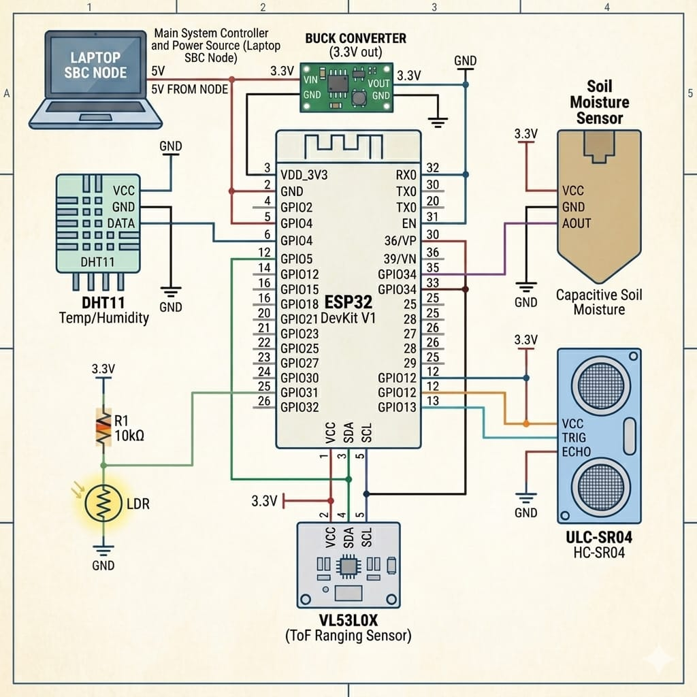

# ORBIT-X: Autonomous Satellite Monitoring & AI Command Console
## MISSION: TITAN-1


---

### 1. INTRODUCTION
**ORBIT-X** is a next-generation autonomous satellite monitoring system designed for the **TITAN-1 Mission**. It bridges the gap between low-level IOT hardware telemetry and high-level AI-driven decision-making. The system provides ground control with a real-time Command Console for tracking orbital dynamics, predicting system failures, and managing ground-truth agricultural nodes (AgriNodes).

Key objectives of ORBIT-X include:
- **High-Fidelity Telemetry Tracking**: Real-time acquisition of 15+ sensor parameters.
- **Autonomous Anomaly Detection**: AI models that identify system drifts before they become critical failures.
- **Hybrid Cloud Integration**: Seamless synchronization between local edge processing and ThingsBoard IOT Cloud.
- **Mission Resilience**: Robust hardware/software layers designed for 100% uptime.

---

### 2. COMPONENTS LIST AND DESCRIPTION

#### **Software Components**
- **Electron (Core Dashboard)**: Cross-platform desktop environment providing a high-performance HUD using Vanilla CSS and JavaScript.
- **Node.js (Orchestration)**: Manages IPC, database transactions, and background services.
- **Python (Neural Core)**: Flask-based microservice hosting heavy-duty ML/DL models (LSTM, Autoencoders).
- **TensorFlow.js & PyTorch**: Used for both local inference and distributed training.
- **MS Access (MDB)**: Local edge database utilizing a custom **Robust ADODB Proxy** for high-frequency data persistence.
- **MQTT (ThingsBoard)**: Protocol for remote telemetry streaming and global model weight synchronization.

#### **Hardware Components (AgriNode System)**


- **ESP32 Microcontroller**: The heart of the hardware node, handling Wi-Fi/Serial communication.
- **MPU6050 (IMU)**: Provides 3-axis Gyroscope and Accelerometer data for orientation tracking.
- **Soil Moisture Sensor**: Real-time monitoring of ground conditions for automated irrigation.
- **DHT11 (Temp/Humidity)**: Environmental monitoring for climate risk assessment.
- **Ultrasonic Sensor (HC-SR04)**: Distance measurement for proximity alerts or fluid level monitoring.
- **LDR (Photoresistor)**: Ambient light detection for solar power optimization.
- **Solar/Battery Management**: Monitors battery voltage and solar charging current.

---

### 3. CIRCUIT DIAGRAM


*Figure 1: Conceptual circuit diagram showing the ESP32 integration with various environmental and inertial sensors.*

---

### 4. CODE AND EXPLANATION

#### **A. AI Neural Core (app.py)**
The Neural Core uses a **Hybrid Neural Engine** to process 15-feature telemetry vectors.
```python
@app.route('/predict/universal', methods=['POST'])
def predict_universal():
    """Universal autonomous prediction endpoint."""
    data = request.json or {}
    res, model_name = _get_prediction(data)
    return jsonify({
        "result": float(res),
        "model_used": model_name or "Stable_Ensemble",
        "timestamp": datetime.now().isoformat()
    })
```
*Explanation*: This endpoint allows the dashboard to query the local Python AI service. It falls back between different models (LSTM for time-series, Autoencoder for anomalies) based on the input signature.

#### **B. Hardware Communication (serial-client.js)**
A resilient serial client that handles auto-discovery and data parsing.
```javascript
// Map incoming labels to buffer keys
if (/temp.?1|t1|temp|temperature/.test(rawKey))    buffer.temp1       = val;
else if (/hum|humidity|rh|h1/.test(rawKey))             buffer.humidity    = val;
else if (/soil|moist|moisture|sm|s1/.test(rawKey))      buffer.soilMoisture= val;
```
*Explanation*: The client uses regex to normalize varied data formats from different MCU firmwares, ensuring the dashboard remains compatible even if the hardware sensor labels change.

#### **C. Data Persistence (database-mgr.js)**
Custom proxy to overcome `node-adodb` limitations on 64-bit systems.
```javascript
class RobustADODB {
    constructor(dbPath) {
        this.cscript = path.join(sysRoot, isX64 ? 'SysWOW64' : 'System32', 'cscript.exe');
        this.proxyScript = path.join(__dirname, '..', 'node_modules', 'node-adodb', 'lib', 'adodb.js');
    }
}
```
*Explanation*: By forcing the use of the 32-bit `cscript.exe` engine, Orbit-X maintains compatibility with legacy MS Access `.mdb` files, which are essential for low-overhead local logging.

---

### 5. WORKING PRINCIPLE & DEEP ANALYSIS

#### **System Flow**
1. **Acquisition**: The ESP32 collects telemetry at 115200 baud.
2. **Standardization**: The `serial-client.js` normalizes the raw hex/text stream into a 15-feature JSON vector.
3. **Local Logic**: The Electron `main.js` checks for critical thresholds (e.g., Soil Moisture < 30%). If triggered, it fires an OS-level notification and initiates local automated actions (e.g., Water Pump simulation).
4. **AI Inference**: The normalized vector is sent to the **Python Neural Core**. 
   - **Autoencoder Analysis**: The model attempts to "reconstruct" the telemetry vector. If the reconstruction error is high, the data point is flagged as an **Anomaly**.
   - **LSTM Forecasting**: Predicts future values for orbital velocity and battery drainage.
5. **Persistence**: Data is batched (5 records per batch) and saved to the MS Access DB to minimize CPU context switching.
6. **Cloud Sync**: Every 45 seconds, the system syncs with **ThingsBoard Cloud**, downloading global model weights to update local intelligence.

#### **Deep Technical Analysis**
- **Adaptive Throttling**: The system dynamically changes its logging frequency. During the "Learning Phase" (first 60 records), it writes every 2 seconds to build a baseline. Once stable, it shifts to 5-second intervals to preserve disk I/O.
- **Hardware-Software Fallback**: If the ESP32 is disconnected, the `serial-client.js` immediately initiates a **Physics-Based Simulation Mode**, generating synthetic telemetry based on orbital mechanics (latitude/longitude drifts) to keep the AI models active.
- **GPU Defense Mode**: On unstable hardware (AMD/Intel drivers), the system detects WebGL crashes and automatically caps the UI at 30 FPS and switches AI loops to CPU-only mode, preventing a total system freeze.

---

### 6. ADVANTAGES
- **Offline First**: Full AI and database capability without an internet connection.
- **Low Latency**: IPC-based communication ensures < 50ms delay between sensor read and UI update.
- **Scalable Architecture**: MQTT support allows one dashboard to monitor multiple AgriNodes globally.
- **High Transparency**: The integrated terminal allows ground control to inspect raw bitstreams in real-time.

---

### 7. CONCLUSION AND FUTURE WORK
The ORBIT-X system successfully integrates IOT hardware, edge databases, and deep learning into a cohesive mission control platform. It demonstrates that complex satellite-grade monitoring can be achieved using accessible hardware and modern web technologies.

**Future Enhancements**:
- **3D Digital Twin**: Integration of Three.js for real-time 3D visualization of the satellite's orientation.
- **Blockchain Logging**: Implementing a decentralized ledger for tamper-proof mission logs.
- **LoRa Support**: Long-range radio integration for monitoring nodes in areas without Wi-Fi.

---

### 8. SCREENSHOT


*Figure 2: The ORBIT-X Command Console HUD showing real-time AI predictions and orbital tracking.*

---

### 9. REFERENCE
1. **Electron Documentation**: [electronjs.org](https://www.electronjs.org/docs)
2. **SerialPort Node.js**: [serialport.io](https://serialport.io/)
3. **ThingsBoard IoT Platform**: [thingsboard.io](https://thingsboard.io/)
4. **TensorFlow & Keras API**: [tensorflow.org](https://www.tensorflow.org/)
5. **Mission TITAN-1 Technical Spec v2.4** (Internal Project Document)
