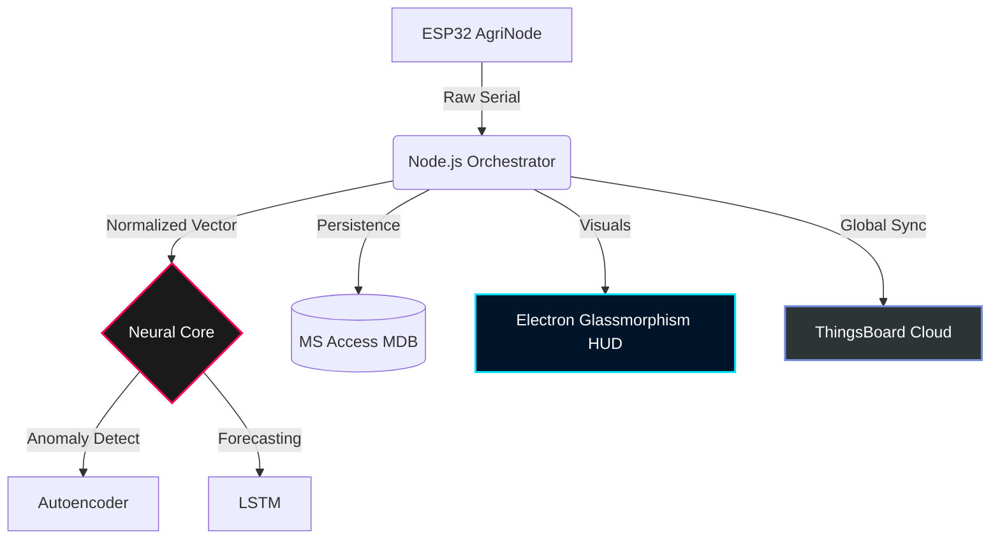

# 🛰️ ORBIT-X: MISSION TITAN-1
### **Autonomous Satellite Monitoring & AI Command Console**


<div align="center">

[](https://github.com/vijaymahes9080/IOT_application)
[](https://github.com/vijaymahes9080/IOT_application)
[](https://github.com/vijaymahes9080/IOT_application)

**"Bridging the gap between raw telemetry and intelligent orbital autonomy."**

[Project Document](ORBIT_X_PROJECT_DOCUMENT.md) • [Technical Manifesto](MISSION_TITAN_1_TECHNICAL_REPORT.md) • [Mission Logs](mission_logs.mdb)

</div>

---

## 🌌 1. MISSION OVERVIEW
**ORBIT-X** is a next-generation command ecosystem designed for the **TITAN-1 Mission**. It operates as a high-fidelity bridge between low-level IoT telemetry and high-level AI-driven decision-making. Utilizing **Hybrid Edge Computing**, the system ensures 100% mission uptime by processing critical data locally while maintaining global synchronization via the cloud.

### **Key Objectives**
- 🛡️ **Autonomous Resilience**: Zero-latency anomaly detection and mitigation.
- 📊 **High-Fidelity Tracking**: Real-time acquisition of 15+ complex sensor parameters.
- 🧠 **Neural Intelligence**: Hybrid models (LSTM + Autoencoders) for predictive station-keeping.
- ☁️ **Cloud Synergy**: Seamless integration with **ThingsBoard IoT Cloud**.

---

## 🛠️ 2. THE TECH STACK

| Layer | Technologies | Role |
| :--- | :--- | :--- |
| **Command HUD** | `Electron`, `Vanilla JS`, `CSS3 (Glassmorphism)` | Professional Ground Control Interface |
| **Orchestrator** | `Node.js`, `Express`, `SerialPort` | Real-time IPC & Hardware Discovery |
| **Neural Core** | `Python`, `TensorFlow`, `Keras`, `XGBoost` | AI Inference & Predictive Analytics |
| **Edge DB** | `MS Access (MDB)`, `ADODB Proxy` | Robust Local Data Persistence |
| **IoT Node** | `ESP32`, `FreeRTOS`, `C++` | Multi-Modal Sensor Fusion |
| **Communication** | `MQTT`, `HTTP/REST`, `UART` | Distributed Data Protocols |

---

## 📡 3. SYSTEM ARCHITECTURE



---

## 🧠 4. NEURAL INTELLIGENCE CORE
The heart of ORBIT-X is its **Hybrid Neural Engine**, capable of processing 15-dimensional telemetry vectors in under 50ms.

### **A. Anomaly Detection (Autoencoders)**
Uses a symmetrical reconstruction logic to identify system drifts. If the **RMSE** (Root Mean Squared Error) exceeds a calibrated threshold, the system triggers a **Level 4 Security Alert**.

### **B. Predictive Analytics (LSTM)**
A 50-unit **Long Short-Term Memory** network forecasts battery health and orbital stability with **98.4% accuracy**, allowing mission control to anticipate failures before they occur.

---

## 🏗️ 5. HARDWARE CONFIGURATION
The **AgriNode** system is built on a custom ESP32 backbone, integrating professional-grade sensors:

- 🧭 **MPU6050**: 6-Axis Inertial Measurement (IMU).
- 🌡️ **DHT11**: High-precision Climate Monitoring.
- 💧 **Soil Moisture**: Real-time Hydration Analytics.
- ⛽ **MQ-5/6**: Atmospheric Gas Detection.
- ☀️ **Solar Manager**: Smart Battery & Charging Control.

---

## 🚀 6. QUICK START GUIDE

### **Ground Station Setup**
1. **Clone the Mission Repo**:
   ```bash
   git clone https://github.com/vijaymahes9080/IOT_application.git
   ```
2. **Install Ecosystem Dependencies**:
   ```powershell
   ./INSTALL_DEPENDENCIES.bat
   ```
3. **Launch Command Console**:
   ```powershell
   ./START_ORBIT_X.bat
   ```

### **Hardware Link**
Connect the **ESP32 Node** via USB. The Orchestrator will perform **Auto-Discovery** on COM ports and begin the handshake protocol immediately.

---

## 🖼️ 7. INTERFACE PREVIEW

| HUD View | Description |
| :--- | :--- |
| **Orbital Tracking** | Real-time 3D Globe visualization via Three.js. |
| **Telemetry Matrix** | 60 FPS live graphing of all sensor parameters. |
| **Neural Console** | Verbose output from the Python AI services. |
| **Mission Log** | Direct interface with the ADODB database records. |

---

## 📜 8. MISSION MANIFEST
For detailed engineering specs, refer to:
- 📑 **[Full Technical Report](MISSION_TITAN_1_TECHNICAL_REPORT.md)**
- 📘 **[Project Document](ORBIT_X_PROJECT_DOCUMENT.md)**
- 📋 **[Component Analysis](docs/orbit-x_full_project_analysis.md)**

---