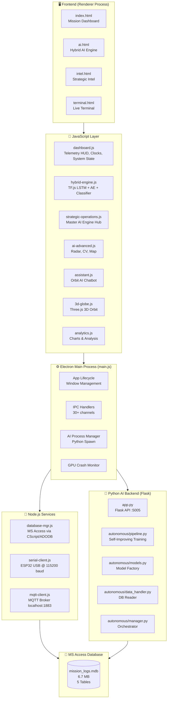
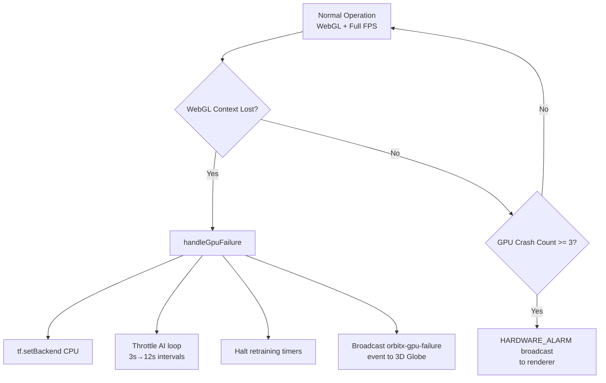
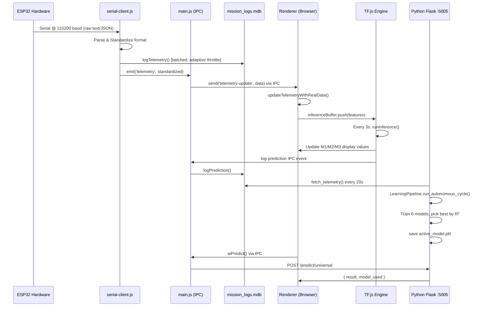

# ORBIT-X Mission Control System — Full Technical Analysis Report
**Generated:** 2026-03-12 | **Version Analyzed:** 6-3 | **Mission Identifier:** TITAN-1

---

## Table of Contents
1. [Executive Summary](#executive-summary)
2. [Project Architecture Overview](#project-architecture-overview)
3. [Technology Stack](#technology-stack)
4. [Application Pages & UI Design](#application-pages--ui-design)
5. [AI & ML Pipeline Analysis](#ai--ml-pipeline-analysis)
6. [Data Ingestion & Hardware Integration](#data-ingestion--hardware-integration)
7. [Database Design & Management](#database-design--management)
8. [Core Services Analysis](#core-services-analysis)
9. [Security Implementation](#security-implementation)
10. [Hardware Resilience Layer](#hardware-resilience-layer)
11. [Known Issues & Recent Session Fixes](#known-issues--recent-session-fixes)
12. [File-by-File Breakdown](#file-by-file-breakdown)
13. [Data Flow Diagram](#data-flow-diagram)
14. [Recommendations & Next Steps](#recommendations--next-steps)

---

## Executive Summary

**ORBIT-X** is a mission-critical, multi-domain satellite and precision agriculture monitoring system built as a **desktop Electron application**. It integrates: a **real-time 3D satellite tracking HUD**, a **dual-layer AI inference engine** (browser-based TF.js + backend Python neural core), **live hardware telemetry** via USB Serial + MQTT, and a **geo-spatial strategic intelligence interface** (computer vision, radar, deployment map, and master AI engine hub).

The system was specifically designed for **Mission TITAN-1**, targeting orbital monitoring and ground-level agricultural intelligence in the **Gandhigram, Dindigul** region of Tamil Nadu, India (GPS: 10.279°N, 77.934°E).

> [!IMPORTANT]
> This application runs as a **standalone Windows desktop app** (Electron v40). It requires **Python 3.10+** installed in PATH for the Neural Core backend. Without Python, approximately 40% of AI prediction features fall back gracefully to the TF.js engine.

---

## Project Architecture Overview



---

## Technology Stack

### Core Runtime
| Component | Technology | Version |
|:---|:---|:---|
| Desktop Container | Electron | v40.6.1 |
| Packaging | electron-builder | v26.8.1 |
| Runtime | Node.js (bundled) | Electron v40 |
| Renderer Context | HTML5 + Vanilla CSS + Vanilla JS | - |

### Frontend Libraries (CDN)
| Library | Purpose |
|:---|:---|
| TensorFlow.js (bundled [tf.min.js](file:///d:/current%20project/orbit-x%206-3/src/js/tf.min.js), ~1.47MB) | In-browser LSTM, Autoencoder, Classifier |
| Three.js (CDN) | 3D satellite orbit globe |
| Chart.js (CDN) | Training loss & analytics graphs |
| Leaflet.js v1.7.1 (CDN) | Deployment map tile rendering |
| Google Fonts — Inter | Premium UI typography |

### Python AI Backend
| Library | Role |
|:---|:---|
| Flask | REST API server (port 5005) |
| PyTorch | LSTM, CNN, Transformer model training |
| Scikit-learn | Random Forest, Gradient Boosting, XGBoost |
| Pandas + NumPy | Data handling & feature engineering |
| Scipy | Kolmogorov-Smirnov drift detection |
| Joblib | Model serialization (`.pkl`) |

### Node.js Services
| Package | Role |
|:---|:---|
| `serialport` v12 | ESP32 hardware serial communication |
| `mqtt` v5 | MQTT broker telemetry subscription |
| `node-adodb` v5 | MS Access Jet 4.0 OLE DB bridge |
| `@tensorflow/tfjs` v4.22 | In-browser inference (also as npm dep) |

---

## Application Pages & UI Design

### Design System
The entire UI uses a **Premium Mission Control HUD** aesthetic:
- **Color Palette:** Deep space dark (`#03060a`), neon cyan accent (`#00e5ff`), amber warning (`#ffab00`), hot critical red (`#ff1744`), safe green (`#00e676`)
- **Typography:** [Inter](file:///d:/current%20project/orbit-x%206-3/services/database-mgr.js#372-379) (Google Fonts) + `JetBrains Mono / Fira Code` for all telemetry data
- **Effects:** Glassmorphism panels (`backdrop-filter: blur(12px)`), particle canvas background (`#cyber-bg`), animated sparklines, radar sweep animation, CV scan-line animation
- **Layout Engine:** CSS Flexbox + Grid; all pages use `overflow: hidden` for a "locked HUD" feel

---

### Page 1: Mission Dashboard ([index.html](file:///d:/current%20project/orbit-x%206-3/src/index.html))
**Purpose:** Primary mission operations center.

**Key Components:**
- **3D Orbital Globe** — Three.js WebGL render of satellite orbit with fallback 2D starfield
- **Real-Time Telemetry Ribbon** — 12 live sensor channels (TEMP-1, TEMP-2, HUMIDITY, SOIL-M, LIGHT, DISTANCE, BATT-V, CURRENT, SOLAR-P, GYRO-X/Y/Z) with sparklines and MIN/MAX stats
- **RDSS Threat Panel** — AI-driven system state (NOMINAL / WARNING / CRITICAL) with risk meter
- **Live Monitoring Modal** — Full-screen enhanced telemetry overlay with raw hex data stream
- **System Diagnostics Modal** — Python, Database, and Serial link status checker
- **Draggable Glass Panels** — All `.glass-panel` elements support HTML5 drag-and-drop reordering

**JS Files:** [dashboard.js](file:///d:/current%20project/orbit-x%206-3/src/js/dashboard.js) (666 lines), [3d-globe.js](file:///d:/current%20project/orbit-x%206-3/src/js/3d-globe.js) (24KB), [analytics.js](file:///d:/current%20project/orbit-x%206-3/src/js/analytics.js) (12KB), [ai-engine.js](file:///d:/current%20project/orbit-x%206-3/src/js/ai-engine.js) (9KB)

---

### Page 2: Hybrid AI Engine ([ai.html](file:///d:/current%20project/orbit-x%206-3/src/ai.html))
**Purpose:** 3-layer TF.js neural inference command center.

**Layout:** 3-column fixed grid (no page scrolling) + compact Agri-Intel module strip at bottom.

**Key Components:**
- **[ L1 ] Data Acquisition Layer** — Live ESP32 soil sensor + satellite telemetry feed display
- **[ L2 ] ML Training Pipeline** — Autonomous LSTM+Classifier+Autoencoder training with Chart.js loss graph, epoch/loss display
- **[ L3 ] Real-Time Inference** — 
  - M1: Velocity Predictor (LSTM) — predicts next orbital velocity
  - M2: Thermal Risk (Residual Classifier) — binary risk classification
  - M3: System Anomaly (Asymmetric Sparse Autoencoder) — reconstruction error anomaly detection
- **Hybrid Agri-Intel Modules (6 Cards):** Prescription mapping, Pest detection, Yield estimation, Irrigation scheduling, Soil health analysis, Climate risk
- **ORBIT-ASSISTANT Chatbot** — Draggable, collapsible AI chat, positioned **top-right** by default

**JS Files:** [hybrid-engine.js](file:///d:/current%20project/orbit-x%206-3/src/js/hybrid-engine.js) (46KB / 1041 lines), [assistant.js](file:///d:/current%20project/orbit-x%206-3/src/js/assistant.js) (17KB), [agri-modules.js](file:///d:/current%20project/orbit-x%206-3/src/js/agri-modules.js) (13KB)

---

### Page 3: Strategic Intelligence Interface ([intel.html](file:///d:/current%20project/orbit-x%206-3/src/intel.html))
**Purpose:** Advanced multi-modal AI intelligence overlays.

**Layout (current — 3×3 CSS Grid):**

| Grid Cell | Component | Area |
|:---|:---|:---|
| `col 1–2 / row 1–2` | **Computer Vision (Satellite)** | 2/3 viewport |
| `col 3 / row 1` | **Conjunction Assessment Radar** | Top-right compact |
| `col 3 / row 2–3` | **Master Strategic AI Hub** | Right tall sidebar |
| `col 1–2 / row 3` | **Deployment Map (Leaflet)** | Wide panoramic bottom |

**Key Components:**
- **Computer Vision (Satellite)** — Animated CV viewport using [satellite-crop.png](file:///d:/current%20project/orbit-x%206-3/src/img/satellite-crop.png) (1MB); bounding box scanner with 4 detection states (Healthy Crop, Moisture Stress, Pest Detected, Yield Estimate Hi); `contain` scaling for full image view
- **Conjunction Assessment Radar** — Canvas-based polar radar with sweep animation, 6 tracked orbital objects, color-coded threat levels (cyan/red/orange/gray)
- **Deployment Map** — Leaflet OpenStreetMap tile layer with dark mode CSS filter inversion; 3 coordinate markers around Gandhigram; zoom level 13 for full geographic view
- **Master AI Engine Hub** — 3 scrollable cards for [TH-03/06] AGRI & GIS (irrigation score, yield, NDVI/EVI), [TH-05] SPACE DISASTER RESILIENCE (conjunction probability, TTC, debris count), [TH-06] SPATIAL AI (disease pred, drought monitoring, field health index)

**Strategic Summary Bar:** 4 KPI badges — Orbital Safety, Agri-Yield Confidence, Field Health Index, AI Core Uptime

**JS Files:** [strategic-operations.js](file:///d:/current%20project/orbit-x%206-3/src/js/strategic-operations.js) (275 lines), [ai-advanced.js](file:///d:/current%20project/orbit-x%206-3/src/js/ai-advanced.js) (194 lines)

---

### Page 4: Live Terminal ([terminal.html](file:///d:/current%20project/orbit-x%206-3/src/terminal.html))
**Purpose:** Raw hex telemetry data stream viewer.

**Key Features:**
- Frameless secondary Electron window (900×600)
- Real-time hex data stream visualization
- Mission log viewer

**JS Files:** [terminal.js](file:///d:/current%20project/orbit-x%206-3/src/js/terminal.js) (minimal, 1.5KB)

---

## AI & ML Pipeline Analysis

### Dual-Engine Architecture
ORBIT-X uses **two independent, complementary AI systems** that don't conflict:

```mermaid
graph LR
    A[Telemetry Data] --> B[TF.js Engine\nBrowser]
    A --> C[Python Neural Core\nFlask :5005]

    B --> D[M1: LSTM\nVelocity Prediction]
    B --> E[M2: Residual Classifier\nThermal Risk]
    B --> F[M3: Sparse Autoencoder\nAnomaly Detection]

    C --> G[Autonomous Pipeline\nEvery 20s cycle]
    G --> H[LSTM PyTorch]
    G --> I[Transformer]
    G --> J[Random Forest]
    G --> K[XGBoost]
    G --> L[Gradient Boosting]
    G --> M[CNN]
    G --> N{Best Model\nSelection}
    N --> O[active_model.pkl]
    O --> P[/predict/* endpoints]
```

### TF.js Engine (Browser-Side)
**Location:** [hybrid-engine.js](file:///d:/current%20project/orbit-x%206-3/src/js/hybrid-engine.js)

| Model | Architecture | Input | Output |
|:---|:---|:---|:---|
| **M1** | Conv1D → MaxPool1D → GRU(64) → Dense(32) → Dense(1) | [10, 15] time-series features | Next velocity (km/s) |
| **M2** | Residual Block (Dense 64→64) with Skip Connection → Sigmoid | [10, 15] flattened | Thermal risk probability |
| **M3** | Sparse Autoencoder 64→16→4→16→64→15 (extreme bottleneck) | [15] feature vector | Reconstruction error |

**Feature Engineering (15-feature vector):**
Rolling 5-step window stats: `temp1 mean/std`, `temp2 mean/std`, `batt_voltage mean/std`, `solar_power mean/std`, `temp1 delta`, `velocity delta`, `batt delta`, `gyro_x delta`, `temp_delta`, `power_efficiency`, `orbital_phase`

**Training:** 80/10/10 train/val/test split; 2 epochs per cycle; auto-retrains every 5 minutes; uses IndexedDB for persistence.

**Synthetic Data Fallback:** If DB has <50 records, generates 120 synthetic orbital + agri telemetry rows to ensure model is useful from first boot.

### Python Autonomous Pipeline (Backend)
**Location:** [ai_service/autonomous/pipeline.py](file:///d:/current%20project/orbit-x%206-3/ai_service/autonomous/pipeline.py)

- **Data Drift Detection:** Kolmogorov-Smirnov test (p < 0.05 triggers retraining)
- **Model Tournament:** Trains and evaluates 6 model types per cycle, deploys best by R² score
- **Feedback Loop:** High-error predictions (error_delta > 0.5) from DB are identified for weighted re-sampling
- **Early Stopping:** Overfitting guard — exits training if val_loss > 1.4× train_loss (after epoch 10)
- **Training Rate:** LR=0.1 with ReduceLROnPlateau scheduler (patience=5, factor=0.5)
- **Cycle Interval:** Every **20 seconds** (configurable in [config.json](file:///d:/current%20project/orbit-x%206-3/config.json))

---

## Data Ingestion & Hardware Integration

### Serial Client ([services/serial-client.js](file:///d:/current%20project/orbit-x%206-3/services/serial-client.js))
- Scans COM ports for **Silicon Labs CP210x, Espressif, Arduino** USB-serial devices
- Connects at **115200 baud** with ReadlineParser (`\r\n` delimiter)
- Supports **3 data formats simultaneously:**
  1. **Multi-line text** (ESP32 standard: `Temperature: 24.5`)
  2. **Key: Value** colon-separated lines
  3. **JSON** objects/arrays with full field alias mapping

**Watchdog Timer:** Reconnects if no data received for **30 seconds**

**Simulation Fallback:** If no hardware detected, generates realistic synthetic telemetry every **2 seconds** — including randomized soil moisture (30–60%), soil temp (22–32°C), light (600–1000), and orbital telemetry

**Data Standardization Bridge:**
All incoming formats are normalized to a single object:
```json
{
  "satellite": { "latitude": 10.36, "longitude": 77.96, "distance": 12.4, "velocity": 7.6, "sys": { ... } },
  "esp32": { "soilMoisture": 45, "soilTemp": 24, "ldrSensor": 750, "humidity": 55, "ultrasonic": 120 },
  "farm_id": 1, "crop_type": "Wheat"
}
```

### MQTT Client ([services/mqtt-client.js](file:///d:/current%20project/orbit-x%206-3/services/mqtt-client.js))
- Connects to `mqtt://localhost:1883`
- Subscribes to topic: `satellite/titan-1/telemetry`
- Timeout: 5000ms | Reconnect: 10,000ms
- Same telemetry standardization as serial client

### Automation Logic (in [main.js](file:///d:/current%20project/orbit-x%206-3/main.js))
- **Low Moisture Alert:** If soil moisture < 30%, triggers OS `Notification` (debounced to 1/60s) and logs anomaly to DB
- **Pump Simulation:** Sets `isPumpActive = true` when moisture < 30%; resets when > 40%

---

## Database Design & Management

### Database: [mission_logs.mdb](file:///d:/current%20project/orbit-x%206-3/mission_logs.mdb) (MS Access Jet 4.0)
**Current Size:** ~6.7 MB | **Engine:** Microsoft Jet 4.0 OLE DB via 32-bit CScript proxy

**Tables:**

| Table | Key Columns | Purpose |
|:---|:---|:---|
| `telemetry_logs` | 20 columns: lat, lon, dist, vel, temp1/2, batt, solar, gyro x/y/z, soil moisture/temp, ldr, humidity, ultrasonic | Raw sensor data log |
| `ai_predictions` | model_name, input_features (MEMO), predicted_value, confidence, label, actual_value, error_delta | AI prediction tracking with feedback |
| `anomaly_events` | severity, sensor_id, description (MEMO), threat_score, system_state, resolved | Alert and anomaly logging |
| `mission_sessions` | operator_name, start/end, total_packets, anomalies | Session management |
| `model_training_snapshots` | model_name, epochs, loss, val_loss, accuracy, weights_json (MEMO) | AI model audit trail |

**Key Design Decisions:**
- **Adaptive Write Throttling:** First 60 records written every 2s; then slows to 5s to preserve I/O
- **Write Batching:** Groups up to 5 INSERT statements into one CScript spawn (massive CPU savings)
- **In-Memory Cache:** 15–30s TTL cache on frequent queries (record count, recent telemetry)
- **SQL Injection Protection:** Custom [sanitize()](file:///d:/current%20project/orbit-x%206-3/services/database-mgr.js#336-353) and [sanitizeNum()](file:///d:/current%20project/orbit-x%206-3/services/database-mgr.js#354-360) functions strip null bytes, semicolons, and escape all quotes
- **Queue Manager:** Sequential `dbQueue` prevents concurrent CScript spawns that could corrupt data

**Custom ADODB Layer:** Uses `SysWOW64/cscript.exe` (forced 32-bit for Jet 4.0 compatibility on 64-bit Windows) with the `node-adodb` proxy script.

### Database Reset
Full reset via [resetDatabase()](file:///d:/current%20project/orbit-x%206-3/services/database-mgr.js#591-615) — `DELETE FROM` all tables + `ALTER COLUMN id COUNTER(1,1)` to reset AutoIncrement counters.

---

## Core Services Analysis

### [main.js](file:///d:/current%20project/orbit-x%206-3/main.js) (Electron Main — 456 lines)
**Key Responsibilities:**
- Window creation (1920×1080, min 1280×720), maximized on startup
- Frameless terminal window (900×600)
- AI Process lifecycle manager: spawns Python Flask, restarts up to 5 times on failure with exponential backoff (2s×count)
- 30+ IPC channels (`ipcMain.handle`/[on](file:///d:/current%20project/orbit-x%206-3/config.json)) bridging renderer to Node.js services
- GPU crash detector (escalates to soft-mode after 3 crashes)
- EPIPE/EOF safe console wrapper to prevent fatal Windows TTY crashes

### [preload.js](file:///d:/current%20project/orbit-x%206-3/preload.js)
Exposes all IPC channels to renderer via `contextBridge.exposeInMainWorld('electronAPI', {...})` with contextIsolation enabled.

### [ai_service/app.py](file:///d:/current%20project/orbit-x%206-3/ai_service/app.py) (Flask — 293 lines)
**REST API Endpoints:**

| Endpoint | Method | Purpose |
|:---|:---|:---|
| `/health` | GET | Returns pipeline status, best model, accuracy, drift flag |
| `/predict/universal` | POST | Unified prediction from active model |
| `/predict/yield` | POST | Maps output to kg/ha yield range |
| `/predict/irrigation` | POST | Returns water quantity recommendation |
| `/predict/pest` | POST | Disease probability + treatment advisory |
| `/predict/soil` | POST | Soil health score + fertilizer recommendation |
| `/predict/maps` | POST | Returns mock GeoJSON with average NDVI |
| `/predict/climate` | POST | Drought risk % + heat stress alert |
| `/chat` | POST | Knowledge-based AI assistant (6 topic areas) |
| `/reset` | POST | Clears all model weights |
| `/shutdown` | POST | Graceful Flask + pipeline stop |

---

## Security Implementation

| Layer | Control |
|:---|:---|
| **Content Security Policy** | Set on both HTML meta tags and HTTP response headers. Whitelists only: self, 127.0.0.1:5005/5000, localhost:1883, cdnjs, jsdelivr, unpkg, fonts.googleapis.com, Wikipedia API |
| **Context Isolation** | `contextIsolation: true`, `nodeIntegration: false` — renderer cannot access Node APIs directly |
| **SQL Injection** | Custom sanitizer strips null bytes (`\x00`), semicolons, and double-escapes single quotes for all DB inputs |
| **Process Isolation** | Python AI service runs as a separate child process; killed via `taskkill /f /t` on app quit |
| **Hardware Acceleration** | HTTP cache and GPU shader disk cache disabled to prevent cache-based exploits |

---

## Hardware Resilience Layer

This is one of the most sophisticated aspects of ORBIT-X — purpose-built for **AMD/Intel driver instability on Windows**:



**Electron-Level GPU Flags (applied at startup):**
```
disable-direct-composition       → Fixes AMD VideoProcessor D3D11 errors
disable-accelerated-video-decode → Prevents D3D11 device removal
disable-gpu-memory-buffer-video-frames → Stabilizes AMD buffers
disable-features=D3D11VideoDecoder → Kills specific failing extension
limit-fps=30                     → Emergency CPU/thermal saver
enable-webgl2-compute-context    → Maximizes TFJS WebGL2 performance
ignore-gpu-blocklist             → Ensures WebGL works on blocked drivers
```

---

## Known Issues & Recent Session Fixes

Based on recent conversation history:

### Fixed Issues (This Dev Session)
| Issue | Resolution |
|:---|:---|
| Strategic Intel Interface: components too small or overflowing | Rebuilt layout from 2×2 grid to 3×3 CSS area grid |
| Computer Vision image not fully visible (was `cover`) | Changed to `background-size: contain` with dark background |
| Deployment Map too zoomed in | Zoom level changed from 14 → 13 for wider geographic context |
| Chatbot defaulted to bottom-right, overlapping content | Repositioned to `top: 100px; right: 40px` (top-right) |
| AI Engine page was scrollable | Set `overflow: hidden` on main grid container; reduced gaps/padding |
| [assistant.js](file:///d:/current%20project/orbit-x%206-3/src/js/assistant.js) syntax error — broken if/else block | Restored complete localStorage position loading logic |
| Accidental `.s#orbit-chatbot` CSS selector in layout.css | Removed spurious block from layout.css |
| Strategic Themes modal (was added then removed) | Reverted in prior session; confirmed removed |
| AI column in Hybrid Engine had no independent scrolling | Added `overflow-y: auto` + slim scrollbar to each `.ai-column` |
| [satellite-crop.png](file:///d:/current%20project/orbit-x%206-3/src/img/satellite-crop.png) not showing full image content | Fixed via `background-size: contain` + explicit dark background |

### Remaining Observations
> [!WARNING]
> The `chatbot` dragging position reset between page navigations is expected behavior — `localStorage` key `orbit-chatbot-pos` is cleared in [intel.html](file:///d:/current%20project/orbit-x%206-3/src/intel.html) via a `<script>` block. This may need to be removed if users want to preserve position across pages.

> [!NOTE]
> The [assistant.js](file:///d:/current%20project/orbit-x%206-3/src/js/assistant.js) lint errors (TypeScript analyzer complaining about JS class syntax) are **false positives** from the IDE's TS linter applied to a [.js](file:///d:/current%20project/orbit-x%206-3/main.js) file — the code is valid ES6+ JavaScript and runs correctly in Electron's V8 engine.

---

## File-by-File Breakdown

| File | Size | Lines | Role |
|:---|:---|:---|:---|
| [main.js](file:///d:/current%20project/orbit-x%206-3/main.js) | 17KB | 456 | Electron main process, IPC hub, AI spawn |
| [preload.js](file:///d:/current%20project/orbit-x%206-3/preload.js) | 1.7KB | ~45 | Electron context bridge |
| [config.json](file:///d:/current%20project/orbit-x%206-3/config.json) | 963B | 37 | Mission config, DB/MQTT/serial/AI settings |
| [src/index.html](file:///d:/current%20project/orbit-x%206-3/src/index.html) | 13.5KB | ~300 | Mission Dashboard page |
| [src/ai.html](file:///d:/current%20project/orbit-x%206-3/src/ai.html) | 20.7KB | 345 | Hybrid AI Engine page |
| [src/intel.html](file:///d:/current%20project/orbit-x%206-3/src/intel.html) | ~11KB | ~160 | Strategic Intelligence Interface |
| [src/terminal.html](file:///d:/current%20project/orbit-x%206-3/src/terminal.html) | 4KB | ~80 | Live terminal window |
| [src/css/variables.css](file:///d:/current%20project/orbit-x%206-3/src/css/variables.css) | 2.2KB | 103 | Design tokens, color palette |
| [src/css/layout.css](file:///d:/current%20project/orbit-x%206-3/src/css/layout.css) | 5.1KB | ~275 | Grid layouts, panel structures |
| [src/css/components.css](file:///d:/current%20project/orbit-x%206-3/src/css/components.css) | 11KB | 490 | UI components, chatbot, radar, CV, map |
| [src/js/dashboard.js](file:///d:/current%20project/orbit-x%206-3/src/js/dashboard.js) | 26.8KB | 666 | Telemetry HUD, system state, diagnostics |
| [src/js/hybrid-engine.js](file:///d:/current%20project/orbit-x%206-3/src/js/hybrid-engine.js) | 46.7KB | 1041 | TF.js 3-model AI engine (largest file) |
| [src/js/strategic-operations.js](file:///d:/current%20project/orbit-x%206-3/src/js/strategic-operations.js) | 14.9KB | 275 | Orbital+Agri+Geo strategic AI computations |
| [src/js/ai-advanced.js](file:///d:/current%20project/orbit-x%206-3/src/js/ai-advanced.js) | 6.7KB | 194 | Radar canvas, CV scanner, Leaflet map |
| [src/js/assistant.js](file:///d:/current%20project/orbit-x%206-3/src/js/assistant.js) | 17.3KB | 390 | Chatbot UI, drag, voice, Wikipedia NLP |
| [src/js/3d-globe.js](file:///d:/current%20project/orbit-x%206-3/src/js/3d-globe.js) | 24.4KB | ~500 | Three.js WebGL orbital globe |
| [src/js/analytics.js](file:///d:/current%20project/orbit-x%206-3/src/js/analytics.js) | 12.5KB | ~280 | Charts, AI performance graphs |
| [src/js/agri-modules.js](file:///d:/current%20project/orbit-x%206-3/src/js/agri-modules.js) | 13.6KB | ~300 | 6 precision agriculture module API calls |
| [src/js/tf.min.js](file:///d:/current%20project/orbit-x%206-3/src/js/tf.min.js) | 1.47MB | - | TensorFlow.js bundled (offline capable) |
| [services/database-mgr.js](file:///d:/current%20project/orbit-x%206-3/services/database-mgr.js) | 26.7KB | 616 | MS Access OLE DB adapter, all CRUD ops |
| [services/serial-client.js](file:///d:/current%20project/orbit-x%206-3/services/serial-client.js) | 12.8KB | 282 | ESP32 hardware serial parser + sim fallback |
| [services/mqtt-client.js](file:///d:/current%20project/orbit-x%206-3/services/mqtt-client.js) | 2.3KB | ~60 | MQTT subscriber |
| [services/mock-publisher.js](file:///d:/current%20project/orbit-x%206-3/services/mock-publisher.js) | 2.9KB | ~70 | Test data publisher for MQTT |
| [ai_service/app.py](file:///d:/current%20project/orbit-x%206-3/ai_service/app.py) | 12.8KB | 293 | Flask AI REST API, 10 endpoints |
| [ai_service/autonomous/pipeline.py](file:///d:/current%20project/orbit-x%206-3/ai_service/autonomous/pipeline.py) | 7.7KB | 170 | 6-model tournament + drift detection + deploy |
| [ai_service/autonomous/manager.py](file:///d:/current%20project/orbit-x%206-3/ai_service/autonomous/manager.py) | 2KB | ~55 | Background thread orchestrator |
| [ai_service/autonomous/models.py](file:///d:/current%20project/orbit-x%206-3/ai_service/autonomous/models.py) | 2.4KB | ~65 | ModelFactory: LSTM, CNN, Transformer, RF, XGB, GB |
| [ai_service/autonomous/data_handler.py](file:///d:/current%20project/orbit-x%206-3/ai_service/autonomous/data_handler.py) | 2.6KB | ~70 | DB reader for Python pipeline |
| [mission_logs.mdb](file:///d:/current%20project/orbit-x%206-3/mission_logs.mdb) | 6.7MB | - | MS Access database (telemetry, AI logs, anomalies) |

---

## Data Flow Diagram



---

## Recommendations & Next Steps

> [!TIP]
> The following are prioritized improvements based on the current codebase analysis.

### High Priority
1. **Remove localStorage chatbot position reset in [intel.html](file:///d:/current%20project/orbit-x%206-3/src/intel.html)** (lines 165–169) — this line-level clear forcibly resets the user's preferred chat position every time they visit the Strategic Intel page. It was added as a bug workaround but is now counter-productive.

2. **Python Dependency Check UI** — Add a dedicated "Setup Guide" modal that appears on first launch if [isPythonInstalled()](file:///d:/current%20project/orbit-x%206-3/main.js#70-85) returns false, with step-by-step installation instructions.

3. **Satellite crop image** ([satellite-crop.png](file:///d:/current%20project/orbit-x%206-3/src/img/satellite-crop.png), 1MB) — Consider compressing to WebP format to reduce load time and memory usage.

### Medium Priority
4. **Add HTTPS/WSS support for MQTT** — Currently uses unencrypted `mqtt://localhost:1883`. For production deployment, upgrade to `mqtts://` with TLS.

5. **Model persistence strategy** — The TF.js models stored in IndexedDB can be lost if browser cache is cleared (Electron partition). Consider periodically exporting weights to the filesystem via `tf.io.fileSystem`.

6. **Database migration plan** — MS Access (Jet 4.0) is 32-bit only and limited to ~2GB. For scale, consider SQLite via `better-sqlite3` which has better Electron native module support and no architecture restrictions.

7. **Mock-publisher.js** — Currently only used for testing. Should be wrapped behind a `--mock` flag to prevent accidental activation in production.

### Low Priority
8. **Agri-Modules API calls** — All 6 modules in [agri-modules.js](file:///d:/current%20project/orbit-x%206-3/src/js/agri-modules.js) call the Python Flask endpoints. These could be parallelized using `Promise.allSettled()` instead of being called individually for faster panel loading.

9. **Terminal page enhancements** — The [terminal.html](file:///d:/current%20project/orbit-x%206-3/src/terminal.html) is minimal (4KB). Adding filterable log levels (INFO/WARN/ERROR), export to [.txt](file:///d:/current%20project/orbit-x%206-3/ai_service/requirements.txt), and search-in-buffer would significantly improve field diagnostics.

10. **Responsive layout for smaller screens** — Currently `minWidth: 1280`. Adding CSS `@media` queries for compact views would help when running on laptops with 1366×768 displays.

---

## Summary Statistics

| Metric | Value |
|:---|:---|
| Total Source Files | 28+ |
| Total JavaScript (Frontend) | ~220KB |
| Total CSS | ~18KB |
| Total Python (AI Backend) | ~28KB |
| Total Node.js Services | ~42KB |
| Electron Main Process | ~17KB |
| TF.js Bundle (bundled) | 1.47MB |
| Database Current Size | 6.7MB |
| AI Models Supported | 9 (3 TF.js + 6 Python) |
| IPC Channels | 30+ |
| REST API Endpoints | 10 |
| Database Tables | 5 |
| DB Columns (telemetry) | 20 |
| Telemetry Channels (live) | 12 |
| UI Pages | 4 |

---

*Report generated by Antigravity AI Assistant — ORBIT-X v6-3 Analysis — Mission TITAN-1 // Ground Control 1*
